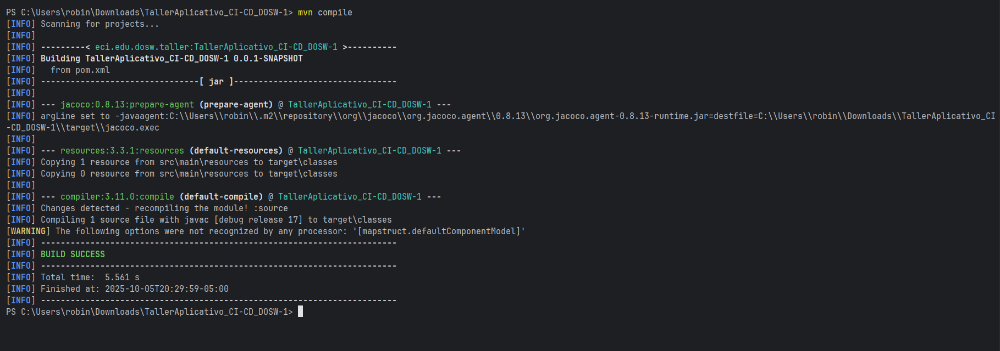
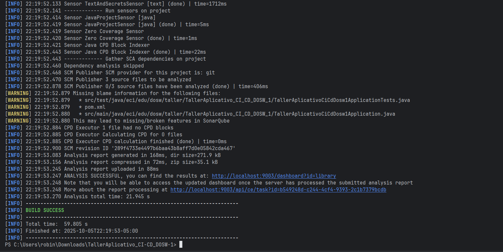
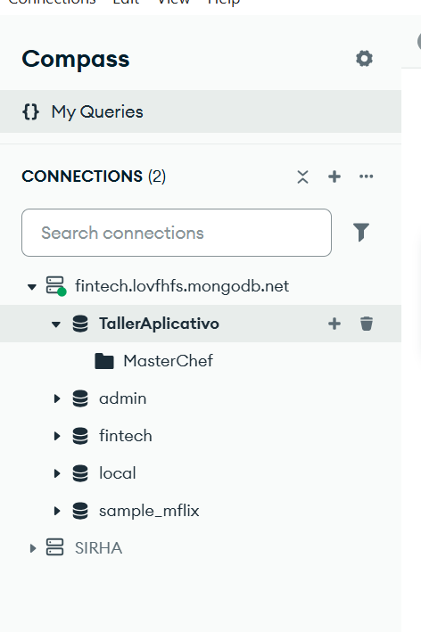
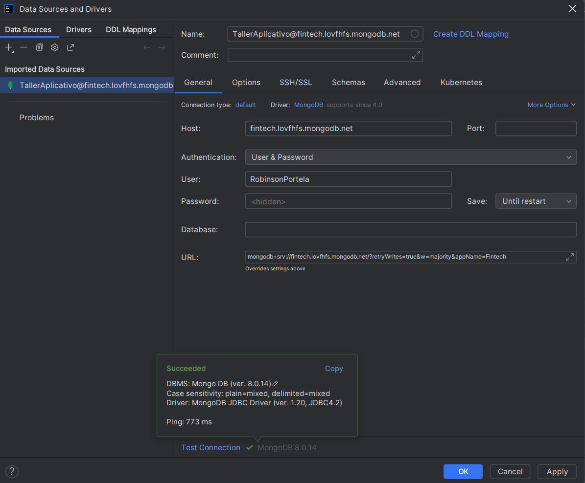
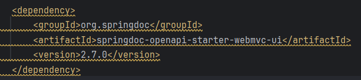
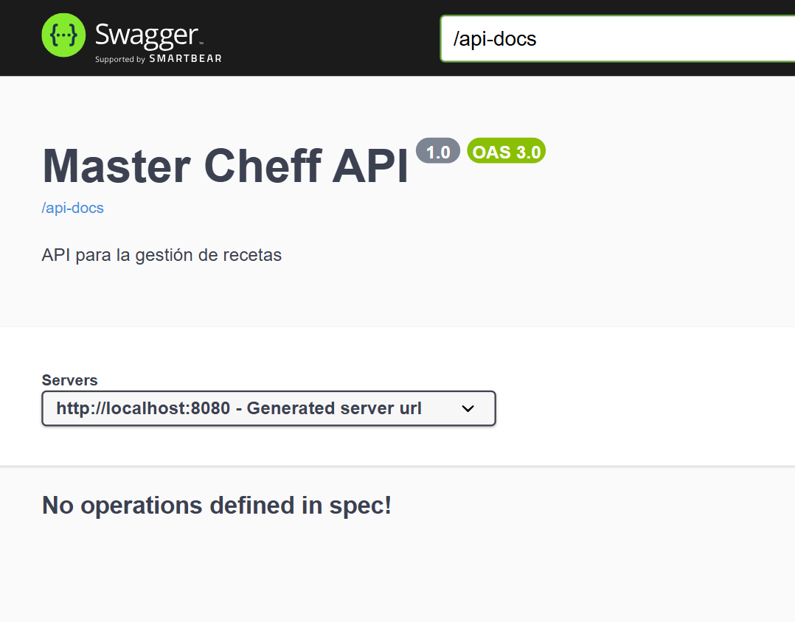

# TallerAplicativo_CI-CD_DOSW-1

**Autor:** 
- Robinson Steven Nunez Portela


**Nombre de la rama Principal:**

- `main`

**Rama en la que se trabajara:**

- `develop`

---

# CASO DE ESTUDIO – MÁSTER CHEF CELEBRITY


Se nos pide crear un sitio web para un programa de comida, en cual quieren que los televidentes puedan consultar 
y aprender las recetas a lo largo de las temporadas ya realizadas. 

Los clientes también deben poder interactuar en el sitio de manera que puedan publicar sus recetas. 


---

## Pruebas de ejecución

**Requisitos:**

Compilamos el proyecto con el comando 

```bash
mvn compile
```



💻 *Compilaciòn de SonarQube:*

1. Arrancamos el SonarQube

```bash
 docker run -d --name sonarqube \
  -e SONAR_ES_BOOTSTRAP_CHECKS_DISABLE=true \
  -p 9003:9000 sonarqube:latest
```

2. Vamos al localhost y generamos el token

http://localhost:9003

*token:*  sqa_783afb48be895f28e94d66b3d982f927b36c3bb6

3. Verificamos que compile

```bash
 mvn clean verify
```
4. luego se manda el analisis a SonarQube

```bash
$env:SONAR_TOKEN="squ_49d8276d8344f3e99f6e8687fc2b6191abbfe6a2" 
 mvn -U "-Dsonar.host.url=http://localhost:9003" "-Dsonar.login=$env:SONAR_TOKEN" clean verify sonar:sonar
```

5. y asi compilo y esta listo para las pruebas



---

## Configuración mongo:

1. Entre a mongodb account y cree mi cuenta con la de github
https://account.mongodb.com/account/security/mfa/setup?redirectUri=https%3A%2F%2Fcloud.mongodb.com%2Fuser%2Foidc%2Fstart%3FsessionId%3D5415b26a-5ff4-41ef-81c7-8bbb08d2496c&mfaSetupRequired=true&sessionId=5415b26a-5ff4-41ef-81c7-8bbb08d2496c

2. Entre a  Clusters y use la base de datos de Fintech ya que es la gratuita que tenia

3.  Le di a connect y luego en drivers allí seleccione esto:
    - Driver: Java  - Version: La última disponible en este caso la 5.1 
    - Y me salio la URI: `mongodb+srv://<db_username>:<db_password>@fintech.lovfhfs.mongodb.net/?retryWrites=true&w=majority&appName=Fintech`

4. Despues de darle a done fui a Security/Database Access 
    - Mi nombre de usuario: RobinsonPortela
    - Y de contraseña: F0dqJg3JHaJWIAf2

5. Luego defini en Security/Network Access mi ip y no escogi la 0.0.0.0/0 ya que solo voy a trabajar yo
6. Me fui a MongoDB Compass y conecte la base de no relacional usando la URI 
7. Ya dentro cree una base no relacional llamada TallerEvaluativo



8. Y finalmente lo configure en application.propities y comprobe la conxion



---

## Configuración Swagger:

1. Añadimo esta dependencia en el pom:



2. Se agrego una clase de SecurityConfig para abrir automatcamente el swagger ui
3. Tambien se agrego  SwaggerConfig para especificar la appi en swagger




---
